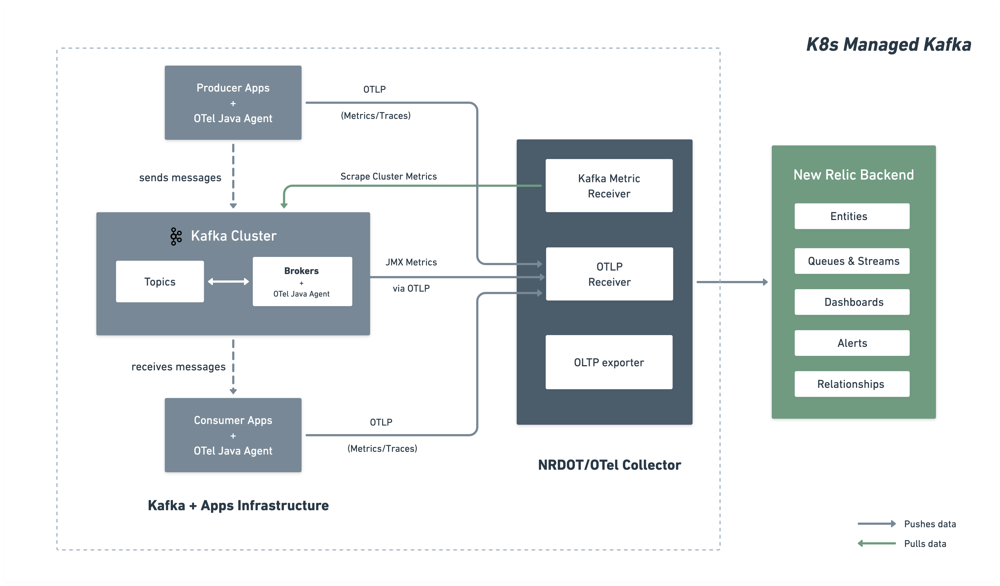

# Monitoring Self-Managed Kafka on Kubernetes with OpenTelemetry Collector

This example demonstrates monitoring a self-managed Apache Kafka cluster on Kubernetes using the [OpenTelemetry Java Agent](https://opentelemetry.io/docs/zero-code/java/agent/) on each broker and the [OpenTelemetry Collector](https://opentelemetry.io/docs/collector/) deployed as a plain Kubernetes Deployment, sending data to New Relic via OTLP. Each broker emits JMX metrics via OTLP, while the collector's [kafkametrics receiver](https://github.com/open-telemetry/opentelemetry-collector-contrib/tree/main/receiver/kafkametricsreceiver) collects consumer lag and cluster-wide metrics. Optional producer and consumer apps are included to generate Kafka traffic and distributed traces. All configuration follows the [New Relic self-hosted Kafka installation and configuration guide](https://docs.newrelic.com/docs/opentelemetry/integrations/kafka/self-hosted/).

## Architecture



## Requirements

* You need to have a Kubernetes cluster, and the `kubectl` command-line tool must be configured to communicate with your cluster. [k3s](https://k3s.io/) is a lightweight option for EC2/Linux VMs (or Docker Desktop [includes a standalone Kubernetes server and client](https://docs.docker.com/desktop/kubernetes/) for local testing).
* [A New Relic account](https://one.newrelic.com/)
* [A New Relic license key](https://docs.newrelic.com/docs/apis/intro-apis/new-relic-api-keys/#license-key)

## Running the example

1. Create your secrets file from the template and update the values:
    ```shell
    cp secrets.yaml.template secrets.yaml
    # Edit secrets.yaml with your New Relic license key
    ```
    See the [New Relic docs](https://docs.newrelic.com/docs/apis/intro-apis/new-relic-api-keys/#license-key) for how to obtain a license key.

    * If your account is based in the EU, update the `NEW_RELIC_OTLP_ENDPOINT` value in [collector.yaml](./collector.yaml) to:

    ```shell
    NEW_RELIC_OTLP_ENDPOINT=https://otlp.eu01.nr-data.net:4317
    ```

2. Deploy the Kafka cluster and OTel Collector:
    ```shell
    kubectl apply -f .
    ```

    Verify all pods are running:
    ```shell
    kubectl get pods -n kafka
    ```

3. (Optional) Build and deploy the sample producer and consumer apps to generate traces and metrics:
    ```shell
    docker build -t kafka-producer:latest ../common/apps/producer/
    docker build -t kafka-consumer:latest ../common/apps/consumer/
    kubectl apply -f sample-apps.yaml
    ```

    * **Docker Desktop**: locally built images are automatically available to the cluster.
    * **kind**: run `kind load docker-image kafka-producer:latest && kind load docker-image kafka-consumer:latest` before applying.
    * **Remote cluster**: push images to a registry and update `imagePullPolicy` in [sample-apps.yaml](./sample-apps.yaml).

When finished, tear down all resources with the following command:
```shell
kubectl delete -f .
```

## Viewing your data

After 1–2 minutes, navigate to **New Relic → Query Your Data**. To list the broker JMX metrics reported, query for:

```sql
FROM Metric SELECT uniques(metricName)
WHERE kafka.cluster.name = 'kafka-k8s-cluster'
AND metricName LIKE 'kafka.%'
SINCE 5 minutes ago LIMIT MAX
```

To view consumer group lag collected by the `kafkametrics` receiver:

```sql
FROM Metric SELECT latest(kafka.consumer_group.lag_sum)
WHERE kafka.cluster.name = 'kafka-k8s-cluster'
FACET group, topic
SINCE 5 minutes ago
```

To view distributed traces from the producer and consumer apps:

```sql
FROM Span SELECT count(*) FACET service.name
WHERE kafka.cluster.name = 'kafka-k8s-cluster'
SINCE 5 minutes ago
```

See [get started with querying](https://docs.newrelic.com/docs/query-your-data/explore-query-data/get-started/introduction-querying-new-relic-data/) for additional details on querying data in New Relic.

## Additional notes

Each Kafka broker runs as a Kubernetes StatefulSet defined in [kafka.yaml](./kafka.yaml), with an init container that downloads the OpenTelemetry Java Agent and mounts it into the broker pod. The agent reads Kafka MBeans via JMX and pushes metrics to the collector over OTLP gRPC.

The collector is configured with four pipelines in [collector.yaml](./collector.yaml): `metrics/broker` retains `broker.id` for per-broker views, `metrics/cluster` removes it for cluster-wide aggregation, `traces/apps` and `logs/apps` handle telemetry from the optional producer and consumer apps.

The `KAFKA_CLUSTER_NAME` value (`kafka-k8s-cluster`) must be consistent across [kafka.yaml](./kafka.yaml), [collector.yaml](./collector.yaml), and [sample-apps.yaml](./sample-apps.yaml). Update all three if you rename the cluster.

## Troubleshooting

For a full troubleshooting guide, see the [New Relic self-hosted Kafka troubleshooting docs](https://docs.newrelic.com/docs/opentelemetry/integrations/kafka/self-hosted/#troubleshooting).

Common first steps:

* **No metrics in New Relic** — check collector logs for errors:
    ```shell
    kubectl logs -l app=otel-collector -n kafka | grep -i error
    ```

* **Brokers stuck in `Init:0/1`** — the init container downloads the OTel Java Agent from GitHub; check its logs:
    ```shell
    kubectl logs kafka-0 -n kafka -c otel-java-agent-init
    ```

* **Producer/consumer `ImagePullBackOff`** — image not available in the cluster; rebuild and restart:
    ```shell
    docker build -t kafka-producer:latest ../common/apps/producer/
    docker build -t kafka-consumer:latest ../common/apps/consumer/
    kubectl rollout restart deployment/kafka-producer deployment/kafka-consumer -n kafka
    ```
