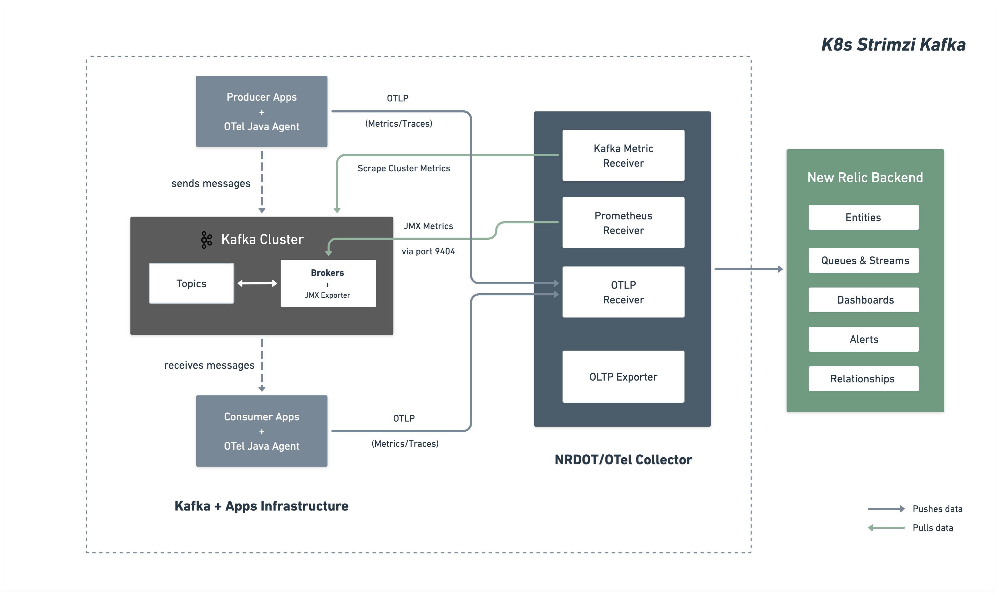

# Monitoring Strimzi Kafka on Kubernetes with OpenTelemetry Collector

This example demonstrates monitoring a [Strimzi](https://strimzi.io/)-managed Kafka cluster on Kubernetes using the Prometheus JMX Exporter on each broker and the [OpenTelemetry Collector](https://opentelemetry.io/docs/collector/), sending data to New Relic via OTLP. The collector's [kafkametrics receiver](https://github.com/open-telemetry/opentelemetry-collector-contrib/tree/main/receiver/kafkametricsreceiver) collects consumer lag and cluster-wide metrics. All configuration follows the [New Relic Strimzi Kafka installation and configuration guide](https://docs.newrelic.com/docs/opentelemetry/integrations/kafka/kubernetes-strimzi/).

## Architecture



## Requirements

* You need to have a Kubernetes cluster, and the `kubectl` command-line tool must be configured to communicate with your cluster. [k3s](https://k3s.io/) is a lightweight option for EC2/Linux VMs (or Docker Desktop [includes a standalone Kubernetes server and client](https://docs.docker.com/desktop/kubernetes/) for local testing).
* [A New Relic account](https://one.newrelic.com/)
* [A New Relic license key](https://docs.newrelic.com/docs/apis/intro-apis/new-relic-api-keys/#license-key)

## Running the example

1. Create your secrets file from the template and update the values:
    ```shell
    cp secrets.yaml.template secrets.yaml
    # Edit secrets.yaml with your New Relic license key
    ```
    See the [New Relic docs](https://docs.newrelic.com/docs/apis/intro-apis/new-relic-api-keys/#license-key) for how to obtain a license key.

    * If your account is based in the EU, update the `NEW_RELIC_OTLP_ENDPOINT` value in [secrets.yaml.template](./secrets.yaml.template) to:

    ```shell
    NEW_RELIC_OTLP_ENDPOINT=https://otlp.eu01.nr-data.net:4317
    ```

2. Install the Strimzi operator and wait for it to be ready:
    ```shell
    kubectl create namespace kafka
    kubectl create -f 'https://strimzi.io/install/latest?namespace=kafka'
    kubectl wait deployment -n kafka strimzi-cluster-operator \
      --for=condition=Available --timeout=5m
    ```

3. Deploy the Kafka cluster and OTel Collector:
    ```shell
    kubectl apply -f .
    ```

    Wait for Kafka to be ready (~3–5 minutes):
    ```shell
    kubectl wait kafka -n kafka kafka-strimzi-cluster \
      --for=condition=Ready --timeout=10m
    ```

## Tear Down

```shell
kubectl delete -f .
kubectl delete -f 'https://strimzi.io/install/latest?namespace=kafka'
kubectl delete namespace kafka
```

> **Note:** `kubectl delete -f .` removes the `kafka` namespace and everything in it, including the Strimzi operator. If you want to redeploy without tearing down the namespace, delete individual resources instead.

## Viewing your data

After 1–2 minutes, navigate to **New Relic → Query Your Data**. To list the broker JMX metrics reported, query for:

```sql
FROM Metric SELECT uniques(metricName)
WHERE kafka.cluster.name = 'kafka-strimzi-cluster'
AND metricName LIKE 'kafka.%'
SINCE 5 minutes ago LIMIT MAX
```

To view consumer group lag collected by the `kafkametrics` receiver:

```sql
FROM Metric SELECT latest(kafka.consumer_group.lag_sum)
WHERE kafka.cluster.name = 'kafka-strimzi-cluster'
FACET group, topic
SINCE 5 minutes ago
```

See [get started with querying](https://docs.newrelic.com/docs/query-your-data/explore-query-data/get-started/introduction-querying-new-relic-data/) for additional details on querying data in New Relic.

## Additional notes

The Strimzi Kafka cluster is configured in [kafka.yaml](./kafka.yaml) to expose JMX metrics via the Prometheus JMX Exporter on port `9404` of each broker pod. The collector's Prometheus receiver scrapes those endpoints and feeds them into the `metrics/broker` pipeline, while the `kafkametrics` receiver connects to the Kafka API for consumer lag and cluster-wide metrics.

The collector runs as a plain Kubernetes `Deployment` (not a DaemonSet) defined in [collector.yaml](./collector.yaml). It uses three pipelines: `metrics/broker` for per-broker metrics, `metrics/cluster/prometheus` and `metrics/cluster/kafkametrics` for cluster-wide aggregation.

The Strimzi cluster name (`kafka-strimzi-cluster`) appears in multiple places — update all of them if you rename the cluster:
- `kafka.yaml`: `metadata.name` on the `Kafka` CR
- `collector.yaml`: the `kafkametrics` bootstrap URL, Prometheus `relabel_configs` regexes, and the `resource` processor
- `sample-apps.yaml`: the `--bootstrap-server` argument in both producer and consumer

This example uses Strimzi 0.46+ with KRaft mode via `KafkaNodePool`. The `Kafka` CR requires the annotations `strimzi.io/node-pools: enabled` and `strimzi.io/kraft: enabled`.

## Troubleshooting

For a full troubleshooting guide, see the [New Relic Strimzi Kafka troubleshooting docs](https://docs.newrelic.com/docs/opentelemetry/integrations/kafka/kubernetes-strimzi/#troubleshooting).

Common first steps:

* **No metrics in New Relic** — check collector logs for errors:
    ```shell
    kubectl logs -l app=otel-collector -n kafka | grep -i error
    ```

* **Kafka not ready** — check Strimzi operator and Kafka pod status:
    ```shell
    kubectl get pods -n kafka
    kubectl describe kafka -n kafka kafka-strimzi-cluster
    ```

* **Port 9404 not reachable** — verify the JMX Exporter is running on broker pods:
    ```shell
    kubectl get pods -n kafka -l strimzi.io/name=kafka-strimzi-cluster-kafka -o wide
    ```
