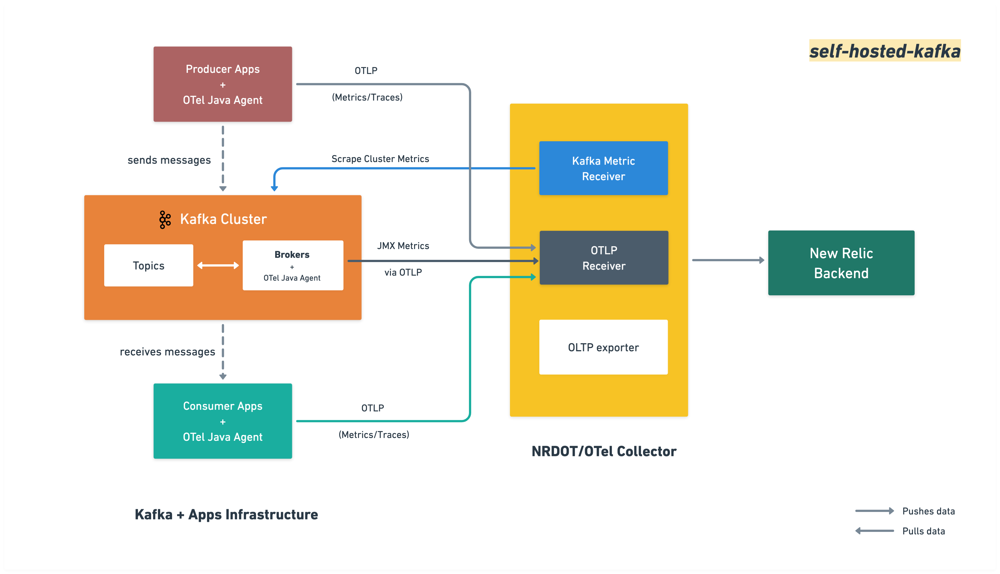

# Monitoring Self-Hosted Kafka with OpenTelemetry Collector

This example demonstrates monitoring a self-hosted Apache Kafka cluster using the [OpenTelemetry Java Agent](https://opentelemetry.io/docs/zero-code/java/agent/) on each broker and the [OpenTelemetry Collector](https://opentelemetry.io/docs/collector/), sending data to New Relic via OTLP. Each broker emits JMX metrics via OTLP, while the collector's [kafkametrics receiver](https://github.com/open-telemetry/opentelemetry-collector-contrib/tree/main/receiver/kafkametricsreceiver) collects consumer lag and cluster-wide metrics. A sample producer and consumer app are included to generate Kafka traffic and distributed traces. All configuration follows the [New Relic self-hosted Kafka installation and configuration guide](https://docs.newrelic.com/docs/opentelemetry/integrations/kafka/self-hosted/).

## Architecture



## Requirements

* [Docker](https://docs.docker.com/get-docker/) and [Docker Compose](https://docs.docker.com/compose/install/) (v2+)
* [A New Relic account](https://one.newrelic.com/)
* [A New Relic license key](https://docs.newrelic.com/docs/apis/intro-apis/new-relic-api-keys/#license-key)

## Running the example

1. Create your secrets file from the template and update the values:
    ```shell
    cp .env.example .env
    # Edit .env with your New Relic license key
    ```
    See the [New Relic docs](https://docs.newrelic.com/docs/apis/intro-apis/new-relic-api-keys/#license-key) for how to obtain a license key.

    * If your account is based in the EU, update the `NEW_RELIC_OTLP_ENDPOINT` value in [.env](./.env.example) to:

    ```shell
    NEW_RELIC_OTLP_ENDPOINT=https://otlp.eu01.nr-data.net:4317
    ```

2. Run the example with the following command:

    ```shell
    docker compose up --build
    ```

    The first run takes a few minutes to build the Java apps and download the OTel Java Agent. Subsequent runs use Docker's build cache and start faster.

    * When finished, stop and clean up resources with the following command:

    ```shell
    docker compose down
    ```

## Viewing your data

After 1–2 minutes, navigate to **New Relic → Query Your Data**. To list the broker JMX metrics reported, query for:

```sql
FROM Metric SELECT uniques(metricName)
WHERE kafka.cluster.name = 'kafka-selfhost-cluster'
AND metricName LIKE 'kafka.%'
SINCE 5 minutes ago LIMIT MAX
```

To view consumer group lag collected by the `kafkametrics` receiver:

```sql
FROM Metric SELECT latest(kafka.consumer.lag)
WHERE kafka.cluster.name = 'kafka-selfhost-cluster'
FACET topic, group
SINCE 5 minutes ago
```

To view distributed traces from the producer and consumer apps:

```sql
FROM Span SELECT count(*) FACET service.name
WHERE kafka.cluster.name = 'kafka-selfhost-cluster'
SINCE 5 minutes ago
```

See [get started with querying](https://docs.newrelic.com/docs/query-your-data/explore-query-data/get-started/introduction-querying-new-relic-data/) for additional details on querying data in New Relic.

## Additional notes

Each Kafka broker runs with the OpenTelemetry Java Agent attached, which reads Kafka MBeans via JMX and pushes metrics to the collector over OTLP gRPC. The MBean-to-metric mappings are defined in [jmx-custom-config.yaml](./jmx-custom-config.yaml) and match the format expected by the New Relic Kafka entity definition.

The collector is configured with two metric pipelines in [otel-collector-config.yaml](./otel-collector-config.yaml): `metrics/broker` retains `broker.id` for per-broker views, and `metrics/cluster` removes it for cluster-wide aggregation.

The producer and consumer apps use only standard `kafka-clients` — no OTel SDK imports. The OTel Java Agent instruments the Kafka client library automatically, linking producer and consumer spans into a single distributed trace visible in New Relic's Distributed Tracing UI.

To use this example against an existing Kafka cluster instead of the bundled one, update the `bootstrap.servers` value in [otel-collector-config.yaml](./otel-collector-config.yaml) under `.receivers.kafkametrics` to point at your brokers, and attach the OTel Java Agent to your broker JVMs as shown in [docker-compose.yaml](./docker-compose.yaml).

## Troubleshooting

For a full troubleshooting guide including steps to verify the collector is running, check Java Agent attachment, enable debug logging, and diagnose missing metrics or OTLP connection errors, see the [New Relic self-hosted Kafka troubleshooting docs](https://docs.newrelic.com/docs/opentelemetry/integrations/kafka/self-hosted/#troubleshooting).

Common first steps:

* **No metrics in New Relic** — check collector logs for export errors:
    ```shell
    docker compose logs otel-collector | grep -i "error\|failed\|export"
    ```

* **Brokers not healthy** — KRaft initialization takes 20–30 seconds; check container status:
    ```shell
    docker compose ps
    ```

* **Producer/consumer keep restarting** — they depend on `kafka-init` completing topic creation; restart them once brokers are healthy:
    ```shell
    docker compose restart producer consumer
    ```
